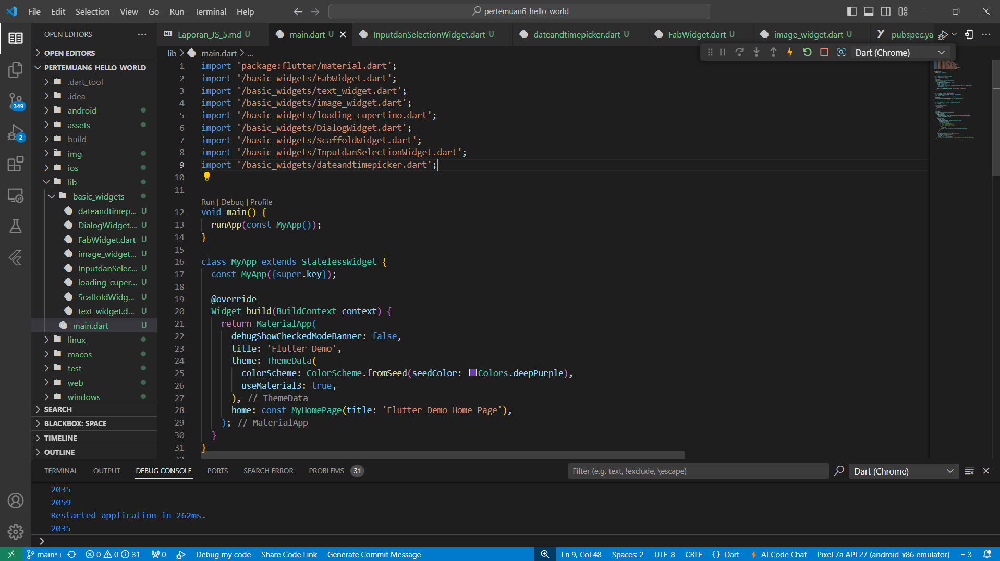

# Praktikum Jobsheet 5

## Nama: Mochammad Dicky Hanun Prasetyo

## NIM : 2241760023

## Kelas : SIB-3D

## Mata Kuliah : Pemrograman Mobile

## Jobsheet Pertemuan ke-6

### Praktikum 1 Membuat Project Flutter Baru

#### Langkah 1: 
##### Buka VS Code, lalu tekan tombol Ctrl + Shift + P maka akan tampil Command Palette, lalu ketik Flutter. Pilih New Application Project.

#### Langkah 2:
##### Kemudian buat folder sesuai style laporan praktikum yang Anda pilih. Disarankan pada folder dokumen atau desktop atau alamat folder lain yang tidak terlalu dalam atau panjang. Lalu pilih Select a folder to create the project in.

#### Langkah 3:
##### Buat nama project flutter hello_world seperti berikut, lalu tekan Enter. Tunggu hingga proses pembuatan project baru selesai.

#### Langkah 4:
##### Jika sudah selesai proses pembuatan project baru, pastikan tampilan seperti berikut. Pesan akan tampil berupa "Your Flutter Project is ready!" artinya Anda telah berhasil membuat project Flutter baru.

#### Hasil RUN Praktikum 1 

#### Praktikum 2: Menghubungkan Perangkat Android atau Emulator
##### Melanjutkan dari praktikum 1, Anda diminta untuk menjalankan aplikasi ke perangkat fisik (device Android atau iOS). Silakan ikuti langkah-langkah pada codelab tautan berikut ini. https://developer.android.com/codelabs/basic-android-kotlin-compose-connect-device?hl=id#0

#### Hasil RUN Praktikum 2

### Praktikum 3: Membuat Repository GitHub dan Laporan Praktikum

#### Langkah 1:
##### Login ke akun GitHub Anda, lalu buat repository baru dengan nama "flutter-fundamental-part1"

#### Langkah 2:
##### Lalu klik tombol "Create repository" lalu akan tampil seperti gambar berikut.

#### Langkah 3:
##### Kembali ke VS code, project flutter hello_world, buka terminal pada menu Terminal > New Terminal. Lalu ketik perintah berikut untuk inisialisasi git pada project Anda.

#### Langkah 4:
##### Pilih menu Source Control di bagian kiri, lalu lakukan stages (+) pada file .gitignore untuk mengunggah file pertama ke repository GitHub.

#### Langkah 5:
##### Beri pesan commit "tambah gitignore" lalu klik Commit (✔)

#### Langkah 6:
##### Lakukan push dengan klik bagian menu titik tiga > Push

#### Langkah 7:
##### Di pojok kanan bawah akan tampil seperti gambar berikut. Klik "Add Remote"

#### Langkah 8:
##### Salin tautan repository Anda dari browser ke bagian ini, lalu klik Add remote. Setelah berhasil, tulis remote name dengan "origin"

#### Langkah 9:
##### Lakukan hal yang sama pada file README.md mulai dari Langkah 4. Setelah berhasil melakukan push, masukkan username GitHub Anda dan password berupa token yang telah dibuat (pengganti password konvensional ketika Anda login di browser GitHub). Reload halaman repository GitHub Anda, maka akan tampil hasil push kedua file tersebut seperti gambar berikut.

#### Langkah 10:
##### Lakukan push juga untuk semua file lainnya dengan pilih Stage All Changes. Beri pesan commit "project hello_world". Maka akan tampil di repository GitHub Anda seperti berikut.

#### Langkah 11:
##### Kembali ke VS Code, ubah platform di pojok kanan bawah ke emulator atau device atau bisa juga menggunakan browser Chrome. Lalu coba running project hello_world dengan tekan F5 atau Run > Start Debugging. Tunggu proses kompilasi hingga selesai, maka aplikasi flutter pertama Anda akan tampil seperti berikut.

#### Langkah 12:
##### Silakan screenshot seperti pada Langkah 11, namun teks yang ditampilkan dalam aplikasi berupa nama lengkap Anda. Simpan file screenshot dengan nama 01.png pada folder images (buat folder baru jika belum ada) di project hello_world Anda. Lalu ubah isi README.md seperti berikut, sehingga tampil hasil screenshot pada file README.md. Kemudian push ke repository Anda.

### Praktikum 4: Menerapkan Widget Dasar

#### Langkah 1: Text Widget
##### Buat folder baru basic_widgets di dalam folder lib. Kemudian buat file baru di dalam basic_widgets dengan nama text_widget.dart. Ketik atau salin kode program berikut ke project hello_world Anda pada file text_widget.dart. Lakukan import file text_widget.dart ke main.dart, lalu ganti bagian text widget dengan kode di atas. Maka hasilnya seperti gambar berikut. Screenshot hasil milik Anda, lalu dibuat laporan pada file README.md.

#### Hasil RUN Praktikum 4 Langkah 1

#### Langkah 2: Image Widget
##### Buat sebuah file image_widget.dart di dalam folder basic_widgets dengan isi kode berikut. Lakukan penyesuaian asset pada file pubspec.yaml dan tambahkan file logo Anda di folder assets project hello_world. Jangan lupa sesuaikan kode dan import di file main.dart kemudian akan tampil gambar seperti berikut.
#### Hasil RUN Praktikum 4 Langkah 2

### Praktikum 5: Menerapkan Widget Material Design dan iOS Cupertino

#### Langkah 1: Cupertino Button dan Loading Bar
##### Buat file di basic_widgets > loading_cupertino.dart. Import stateless widget dari material dan cupertino. Lalu isi kode di dalam method Widget build adalah sebagai berikut.
#### Hasil RUN Praktikum 5 Langkah 1

#### Langkah 2: Floating Action Button (FAB)
##### Button widget terdapat beberapa macam pada flutter yaitu ButtonBar, DropdownButton, TextButton, FloatingActionButton, IconButton, OutlineButton, PopupMenuButton, dan ElevatedButton. Buat file di basic_widgets > fab_widget.dart. Import stateless widget dari material. Lalu isi kode di dalam method Widget build adalah sebagai berikut.
#### Hasil RUN Praktikum 5 Langkah 2

#### Langkah 3: Scaffold Widget
##### Scaffold widget digunakan untuk mengatur tata letak sesuai dengan material design. Ubah isi kode main.dart seperti berikut.
#### Hasil RUN Praktikum 5 Langkah 3

#### Langkah 4: Dialog Widget
##### Dialog widget pada flutter memiliki dua jenis dialog yaitu AlertDialog dan SimpleDialog. Ubah isi kode main.dart seperti berikut.
#### Hasil RUN Praktikum 5 Langkah 4
##### Ketika tombol belum di klik 

##### Ketika tombol sudah di klik 

#### Langkah 5: Input dan Selection Widget
##### Flutter menyediakan widget yang dapat menerima input dari pengguna aplikasi yaitu antara lain Checkbox, Date and Time Pickers, Radio Button, Slider, Switch, TextField. Contoh penggunaan TextField widget adalah sebagai berikut:
#### Hasil RUN Praktikum 5 Langkah 5

#### Langkah 6: Date and Time Pickers
##### Date and Time Pickers termasuk pada kategori input dan selection widget, berikut adalah contoh penggunaan Date and Time Pickers.
#### Hasil RUN Praktikum 5 Langkah 6
##### Ketika tombol belum diklik

##### Ketika tombol sudah diklik

### 11. Tugas Praktikum

#### 1. Selesaikan Praktikum 1 sampai 5, lalu dokumentasikan dan push ke repository Anda berupa screenshot setiap hasil pekerjaan beserta penjelasannya di file README.md!
##### Jawaban: Sudah.

#### 2. Selesaikan Praktikum 2 dan Anda wajib menjalankan aplikasi hello_world pada perangkat fisik (device Android/iOS) agar Anda mempunyai pengalaman untuk menghubungkan ke perangkat fisik. Capture hasil aplikasi di perangkat, lalu buatlah laporan praktikum pada file README.md.
##### Jawaban: 

#### Pada praktikum 5 mulai dari Langkah 3 sampai 6, buatlah file widget tersendiri di folder basic_widgets, kemudian pada file main.dart cukup melakukan import widget sesuai masing-masing langkah tersebut!
##### Jawaban: 

#### Selesaikan Codelabs: Your first Flutter app, lalu buatlah laporan praktikumnya dan push ke repository GitHub Anda!
##### Jawaban:

#### README.md berisi: capture hasil akhir tiap praktikum (side-by-side, bisa juga berupa file GIF agar terlihat proses perubahan ketika ada aksi dari pengguna) dengan menampilkan NIM dan Nama Anda sebagai ciri pekerjaan Anda.
##### Jawaban: 

#### Kumpulkan berupa link repository/commit GitHub Anda kepada dosen yang telah disepakati!
##### Jawaban: